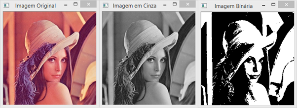

# Redução de Dimensionalidade em Imagens para Redes Neurais

## Descrição do Desafio
Seguindo o exemplo do algoritmo de binarização apresentado em nossa última aula, realize a implementação em Python para transformar uma imagem colorida para níveis de cinza (0 a 255) e para binarizada (0 e 255), preto e branco.

Por meio da imagem é possível visualizar os dois casos esperados:



## Implementação

### Pré-requisitos
Certifique-se de ter Python instalado junto com as bibliotecas necessárias:
- OpenCV
- Matplotlib

Você pode instalá-las usando pip:
```bash
pip install opencv-python matplotlib

